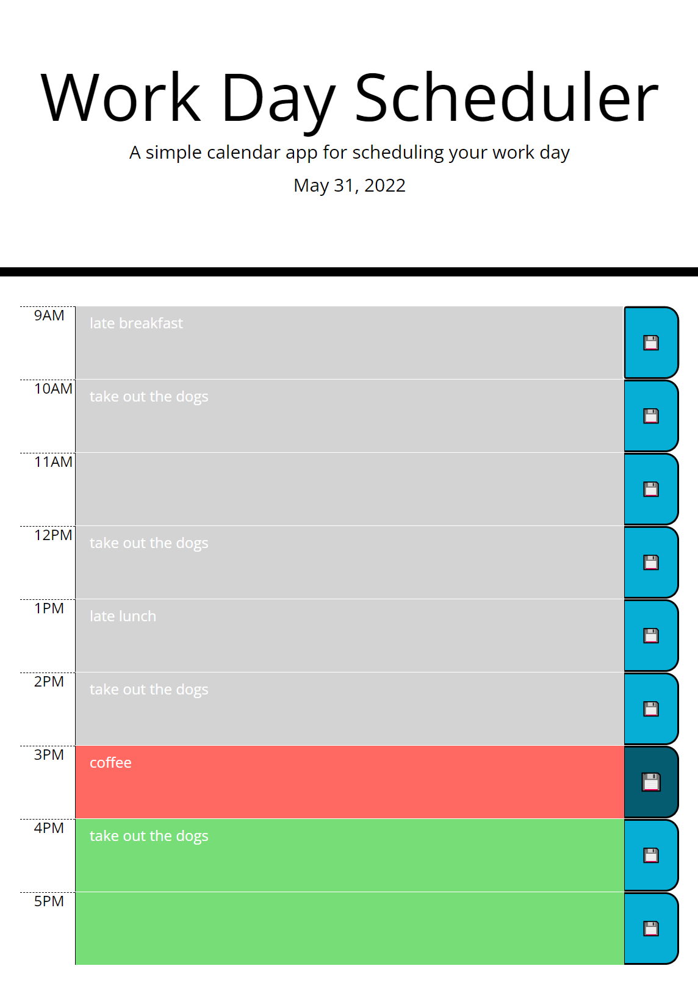

# Work Day Scheduler (05-Third-Party APIs Challenge)

[Live Site on Github.io](https://cokamuro.github.io/workday-scheduler/)

## Table of Contents
- [Description](#description)
- [Visuals](#visuals)
- [Usage](#usage)

## Description
This is the solution HTML, CSS, and JavaScript for the 02-Challenge assignment in the 05-Third-Party APIs Module.

The purpose of the assignment was to take the starter code and complete the work day scheduler.

The finished scheduler uses a prototype table *tr* element, which is then cloned via jQuery to create the time segments.  jQuery is then used to apply the proper time-of-day classes.  jQuery also takes care of the event handling duties, which are in use (along with localStorage) for the save functionality.  [Moment.js](https://momentjs.com/) is used to provide a properly formatted date at the top of the page, and also to provide time formatting in the first *td* element (per row).  

## Visuals
### The site in operation

## Usage
This project is complete and should have no future revisions    
